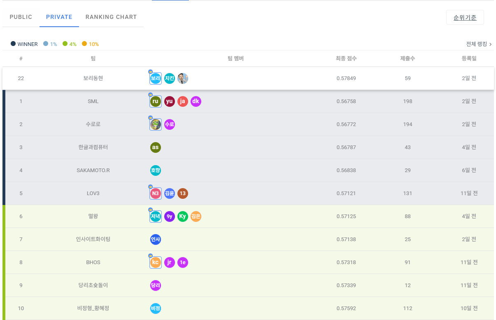
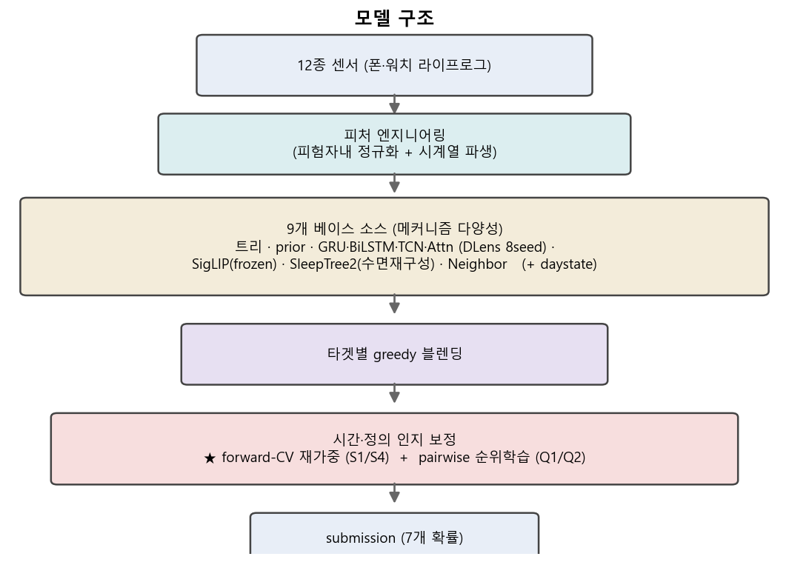
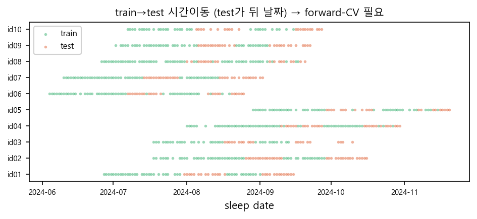
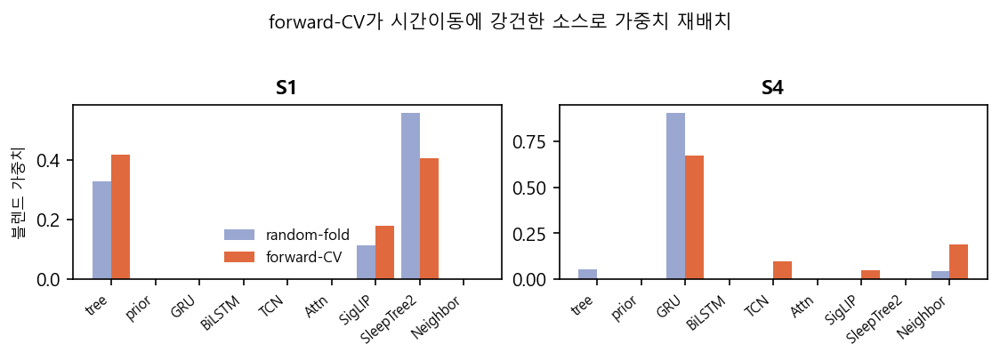
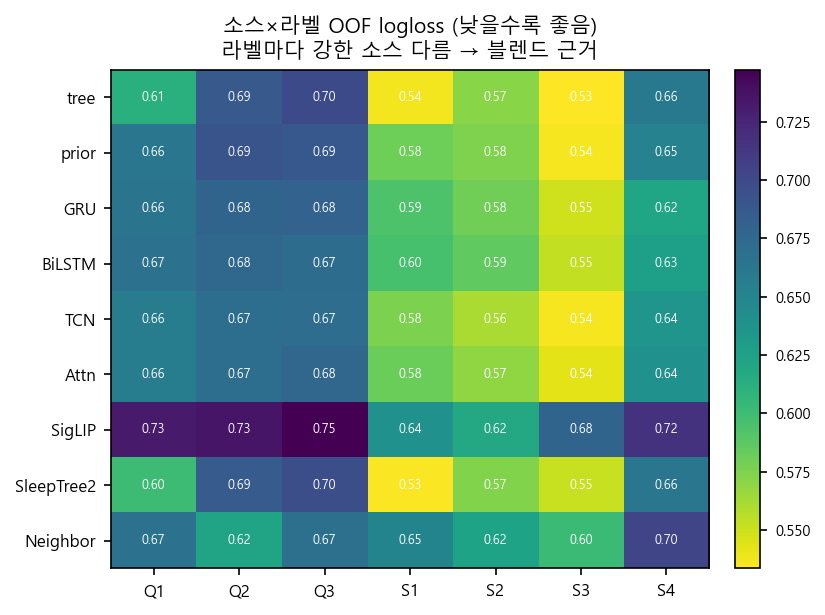

# ETRI 2026 휴먼이해 AI — 수면 7지표 예측

> 스마트폰·스마트워치 센서의 **전날 하루 기록**으로 그날 밤 수면의 **7개 이진 지표**를 예측한다.
> 제5회 ETRI 휴먼이해 인공지능 논문경진대회 (ICTC 2026 / IWETRIAI).

**최종 성적 · Private `Average Log-Loss 0.57849` · 22위** (팀 보리동현)

---

## 💡 한 줄 핵심

> **모델을 더 얹어서 이긴 게 아니라 — 작은 데이터 + 시간 분포 이동에서는 *검증의 신뢰성*이 병목임을 보였다.**

무작위 교차검증(random CV)은 일반화되지 않는 변화를 **체계적으로 보상**한다.
실제로 리더보드에 전이된 개선은 둘뿐이었다 — **분산 감소(DLens)**와 **시간이동 인지 재가중(forward-CV)**.
나머지 ~20개의 "좋아 보이는" 아이디어는 내부 점수만 올리고 실전에선 죽었다.

---

## 🏆 결과

<p align="center"></p>

- **Private 0.57849 / 22위** (chance level 0.693 대비 의미 있는 예측)
- 1등 0.56758과 격차 ~0.011 — 상위권 다수는 미관측 임상 데이터(아래 *한계* 참고)가 필요한 영역
- public→private 셔플에서 상위권이 대거 추락할 때 순위 변동은 작았다 (정직한 검증의 부수효과)

---

## 📋 문제 정의

| 지표 | 의미 | 기준 |
|---|---|---|
| **Q1·Q2·Q3** | 수면질·피로·스트레스 (설문) | **개인 전체기간 평균 대비** 이진화 |
| **S1·S2·S3·S4** | 총수면시간·수면효율·입면지연·중도각성 | **NSF 가이드라인** 절대 충족 여부 |

- 입력: 12종 센서(심박·보행·화면·충전·활동·주변소리·GPS·조도·Wi-Fi·BLE·앱사용)
- 규모: 학습 450박 / 평가 250박, **피험자 10명**, train→test **시간 분포 이동** 존재
- 평가: **Average (Macro) Log-Loss** → 잘 보정된 확률이 핵심 (낮을수록 좋음)

---

## 🔧 접근

<p align="center"></p>

**[다중 소스] → [블렌딩] → [shift-aware 보정]** 3단 구조. 모든 피처는 피험자내 정규화로 "그 사람 평소 대비 오늘"을 인코딩.

---

## 📊 설계 동기 — 데이터가 말해준 것

<p align="center"></p>

피험자마다 평가 밤(주황)이 학습 밤(초록)보다 **뒤 날짜**에 몰려 있다.
밤을 무작위로 섞는 검증은 이 이동을 못 본다 → **앞 날짜 학습 → 뒤 날짜 검증**(forward-chaining)이 필요한 이유.

---

## 📈 무엇이 실제로 통했나

<p align="center"></p>

같은 9소스인데 **무작위폴드**와 **forward-CV**가 고른 S1/S4 가중치가 다르다 — 시간이동에 강건한 소스로 재배치된다.

| 변화 | 무작위폴드 OOF | held-out (실전) |
|---|---|---|
| 다중 시드 평균 (DLens) | 개선 | ✅ 개선(소폭) |
| forward-CV S1/S4 재가중 | — | ✅ **개선(최대)** |
| 고-divergence "새 신호" 수정 | 개선 | ❌ 악화 |

> **교훈**: 내부 점수가 좋아져도 리더보드 보장은 없다. *새 정보를 우기는 것*이 아니라 *이미 있는 걸 더 정직하게 다루는* 개선만 전이됐다.

<details><summary>📈 소스 다양성 (왜 9개를 섞나)</summary>

<p align="center"></p>

라벨마다 가장 잘 맞히는 소스가 다르다(수면재구성이 여러 S에 최강, 이웃이 Q에 최강).
메커니즘이 다른 계열은 예측 상관이 0.24까지 낮아 — 이 **계열 간 다양성**이 블렌드의 이득.
</details>

---

## 🧱 한계 (정직한 천장)

S1~S4는 입력에 **없는** 전문 수면측정기(Withings)로 매긴 라벨이다. 폰·워치는 이를 **간접 추정**할 뿐이라
구조적 상한이 있다. 비전 모델·여러 수면재구성·HRV·외부데이터 등 모든 "큰 베팅"은 누수 없이 검증하면 기여 ≈ 0이었다.
이 천장의 정직한 규명을 **negative result**로 기록한다.

---

## 📄 논문

- **[paper/main.pdf](paper/main.pdf)** — ICTC 2026 제출본 (영어, IEEE 4쪽)
- **[paper/main_kr.pdf](paper/main_kr.pdf)** — 한글 검토본
- 제목: *Validation Reliability, Not Model Capacity, Is the Bottleneck*

---

## ▶️ 실행 방법

```bash
# 1) 대회 데이터를 data/ 에 배치 (라이선스상 저장소 미포함)
#    data/ch2026_metrics_train.csv, ch2026_submission_sample.csv, ch2025_data_items/*.parquet
# 2) 노트북 전체 실행 → submission.csv 생성 (약 12분)
jupyter notebook solution.ipynb
```
환경: Python 3.11 · numpy · pandas · scikit-learn · lightgbm · catboost · torch(CUDA) · transformers · timm

---

## 📁 저장소 구조

```
solution.ipynb        재현 노트북 (원본 데이터 → 제출, self-contained)
solution.py           백본 파이프라인 (9소스 앙상블)
solution_full.py      전체본 (+ pairwise/qclone)
build_solution.py     solution.py + modules/ → solution_full.py
make_notebook.py      solution_full.py → solution.ipynb
modules/              빌드용 피처 모듈 (daystate, qclone_*, presleep3)
paper/                ICTC 논문 (영/한 PDF + 소스 + 그림)
assets/               README 그림
모델설명서.md          방법·환경 요약
개발과정_팀원용.md      개발 여정·실험·실패 기록
LEARNINGS.md          개발 중 교훈
```

> ⚠️ 대회 데이터(`data/`)는 **라이선스·개인정보 보호**상 포함하지 않습니다. 대회 페이지에서 별도 내려받으세요.

---

## 🔗 참고
- ETRI Lifelog Dataset 2024 · NSF Sleep Guidelines · forward-chaining CV (Bergmeir & Benítez, 2012)
